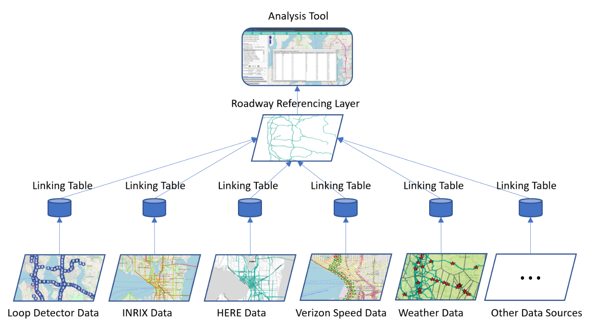
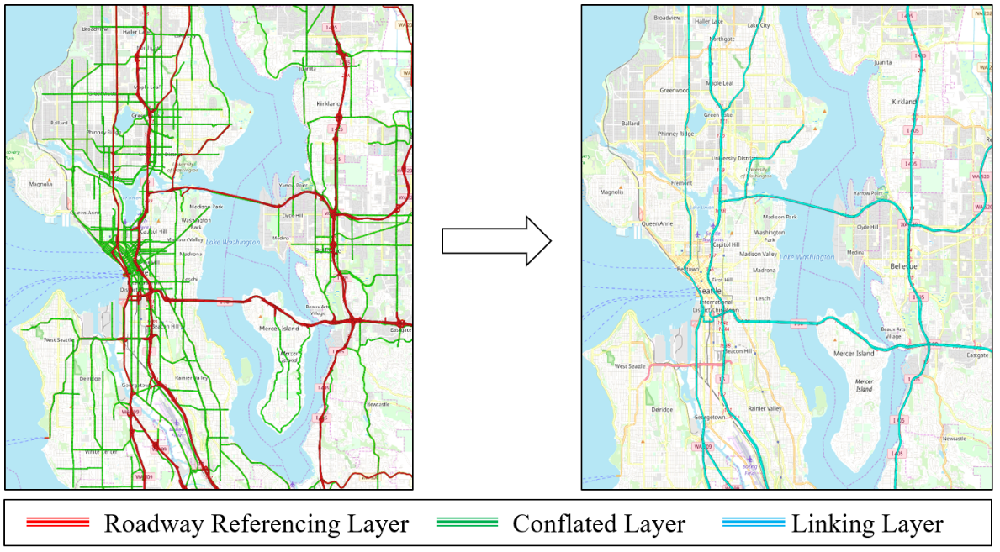

# Map Conflation
> Code for Establishing Multisource Data-Integration Framework for Transportation Data Analytics

This is a repo for demonstrating the map conflation algorithm in Reference [1]. The paper proposed a transportation data integration framework. Each data source can be integrated by mapping the data's geospatial information to a roadway referencing layer. The following figure shows the framework.

<p align="left"></p>

The referencing layer is the WSDOT 24K map ([link](https://www.wsdot.wa.gov/mapsdata/geodatacatalog/)). The conflated layer comes from HERE geographical map. The result of the map conflation is a linking layer that connects the referencing layer and the conflated layer. The following figure demonstrates the map conflation process.

<p align="left"></p>

The detailed steps for preparing the datasets and runing the algorithm is described in the `Jupyter Notebook` file. 

## Reference
[1] Cui, Z., Henrickson, K., Biancardo, S.A., Pu, Z. and Wang, Y., 2020. Establishing Multisource Data-Integration Framework for Transportation Data Analytics. Journal of Transportation Engineering, Part A: Systems, 146(5), p.04020024. \[[link](https://ascelibrary.org/doi/full/10.1061/JTEPBS.0000331)\]

## Cite
If you find this repository, e.g., the code and the datasets, useful in your research, please cite the following paper:
```
@article{cui2020establishing,
  title={Establishing Multisource Data-Integration Framework for Transportation Data Analytics},
  author={Cui, Zhiyong and Henrickson, Kristian and Biancardo, Salvatore Antonio and Pu, Ziyuan and Wang, Yinhai},
  journal={Journal of Transportation Engineering, Part A: Systems},
  volume={146},
  number={5},
  pages={04020024},
  year={2020},
  publisher={American Society of Civil Engineers}
}
```
